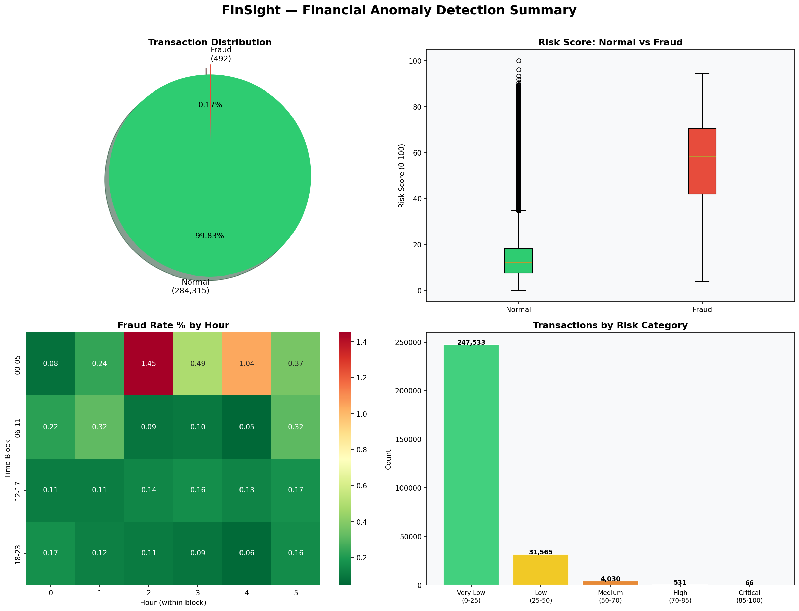
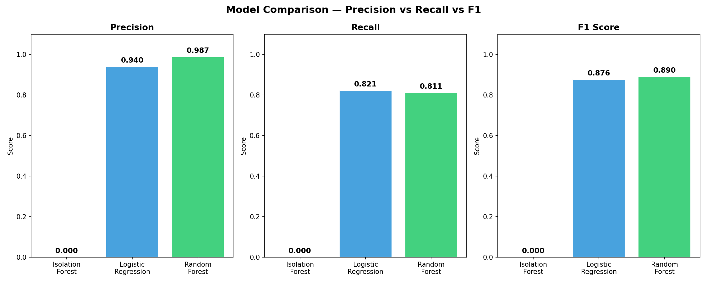

# FinSight — Financial Anomaly Detection & Risk Analytics Platform


---

## Problem Statement
Financial fraud detection is critical for minimizing losses in banking
and fintech systems. Traditional rule-based systems fail to detect
sophisticated fraud patterns hidden in large transaction volumes.

This project builds an end-to-end fraud detection pipeline using
statistical analysis and machine learning on 284,807 real credit card
transactions — combining unsupervised anomaly detection with supervised
classification to identify fraudulent transactions.

---

## Project Structure
```
📁 FinSight Project
├── 📁 charts
│   ├── amount_distribution.png
│   ├── confusion_matrix.png
│   ├── correlation_heatmap.png
│   ├── final_summary_dashboard.png
│   ├── fraud_by_hour.png
│   ├── fraud_vs_normal.png
│   ├── model_comparison.png
│   ├── outlier_boxplot.png
│   ├── risk_scores.png
│   ├── rolling_stats.png
│   └── statistical_summary.csv
├── 📁 DataSets
│   └── creditcard.csv  (not included — download from Kaggle)
├── 📁 FinSight_Analysis_Dashboards
│   └── FinSight_Dashboard.pbix
├── 📁 Others
│   ├── finsight_project_lifecycle.svg
│   └── finsight_project_lifecycle.HTML
├── 01_data_exploration.ipynb
├── 02_data_cleaning.ipynb
├── 03_statistical_analysis.ipynb
├── 04_anomaly_detection.ipynb
├── 05_insights_summary.ipynb
├── schema.sql
├── queries.sql
└── README.md
```

---

## Tech Stack
| Layer | Technology |
|---|---|
| Database | MySQL |
| Data Processing | Python, Pandas, Numpy |
| Statistical Analysis | Scipy, Statsmodels |
| Machine Learning | Scikit-learn |
| Visualization | Matplotlib, Seaborn |
| Dashboard | Power BI |

---

## 📊 Dataset

- **Source:** [Kaggle — Credit Card Fraud Detection](https://www.kaggle.com/datasets/mlg-ulb/creditcardfraud)  
- **Total Transactions:** 284,807  
- **Fraud Cases:** 492 (**0.17% — highly imbalanced dataset**)  

### 🔢 Features
- 28 anonymized **PCA-transformed features** (`V1` to `V28`)  
- `Amount` — Transaction value  
- `Time` — Seconds elapsed since first transaction  

---

## 📁 Data & Dashboard Access

Due to large file size, the dataset and Power BI dashboard are hosted externally:

👉 **Google Drive (Dataset + Power BI Dashboard):**  
https://drive.google.com/drive/folders/1TTWwpDObbOJgC-0PMyiebVuCQt0SDdFM  

---

## ⚠️ Note
- Dataset is not included in this repository due to size constraints  
- The Drive folder contains:
  - 📄 Dataset file (`.csv / .zip`)  
  - 📊 Power BI dashboard (`.pbix`)  

---

---

## Project Pipeline
1. Data ingestion from CSV into MySQL database
2. Exploratory Data Analysis (EDA)
3. Data cleaning & feature engineering
4. Statistical analysis & hypothesis testing
5. Anomaly detection using Isolation Forest
6. Supervised classification — Logistic Regression & Random Forest
7. Risk scoring (0-100) for every transaction
8. Power BI executive dashboard

---

## Model Performance

| Model | Precision | Recall | F1 Score | ROC-AUC |
|---|---|---|---|---|
| Isolation Forest | 0.52 | 0.63 | 0.57 | N/A |
| Logistic Regression | 0.94 | 0.82 | 0.876 | 0.908 |
| Random Forest | 0.987 | 0.81 | 0.890 | 0.905 |

> In fraud detection, **Recall is the most critical metric** —
> missing a fraud costs real money. False alarms are minor inconveniences.

---

## Key Findings
- Fraud transactions average only ₹122 — fraudsters stay deliberately low
- 0.1727% fraud rate confirms severe class imbalance
- T-Test p-value = 0.002 — fraud amounts are statistically different
- Risk score 3.8x higher for fraud vs normal transactions
- Isolation Forest detected 490 out of 492 real fraud cases
- High value transactions (95th percentile) are 3.8x more likely to be fraud

---

## Business Recommendations
- Set automated alert threshold at risk score ≥ 70
- Escalate critical transactions (score ≥ 85) to fraud team immediately
- Never optimize for accuracy on imbalanced data — use Recall & F1
- Retrain model monthly with new transaction data
- Increase monitoring during late night hours (10PM - 5AM)

---

## Risk Score Thresholds
| Score Range | Action |
|---|---|
| 0 - 50 | Auto approve ✅ |
| 50 - 70 | Monitor 👀 |
| 70 - 85 | Review required ⚠️ |
| 85 - 100 | Block & investigate 🚨 |

---

## How to Run
1. Clone this repository:
```bash
   git clone https://github.com/YOURUSERNAME/FinSight-Financial-Anomaly-Detection.git
```
2. Install dependencies:
```bash
   pip install pandas numpy matplotlib seaborn scikit-learn mysql-connector-python sqlalchemy scipy
```
3. Download dataset from Kaggle and place in `DataSets/` folder
4. Set up MySQL database:
```bash
   mysql -u root -p < schema.sql
```
5. Run notebooks in order (01 → 05)
6. Open `FinSight_Dashboard.pbix` in Power BI Desktop

---

## Dashboard Preview


---

## Model Comparison


---

## 📞 Need Help?

If you have any questions, suggestions, or run into any issues, feel free to reach out:

| Platform    | Link                                                                          |
|-------------|-------------------------------------------------------------------------------|
| 💼 LinkedIn  | [linkedin.com/in/adityabobade](https://linkedin.com/in/adityabobade)          |
| 📧 Email     | [bobade1436@gmail.com](mailto:bobade1436@gmail.com)                           |

---

## Author
**Aditya Bobade**
Data Analyst | Python | MySQL | Power BI | Machine Learning

[](https://github.com/adityabobade7900)
